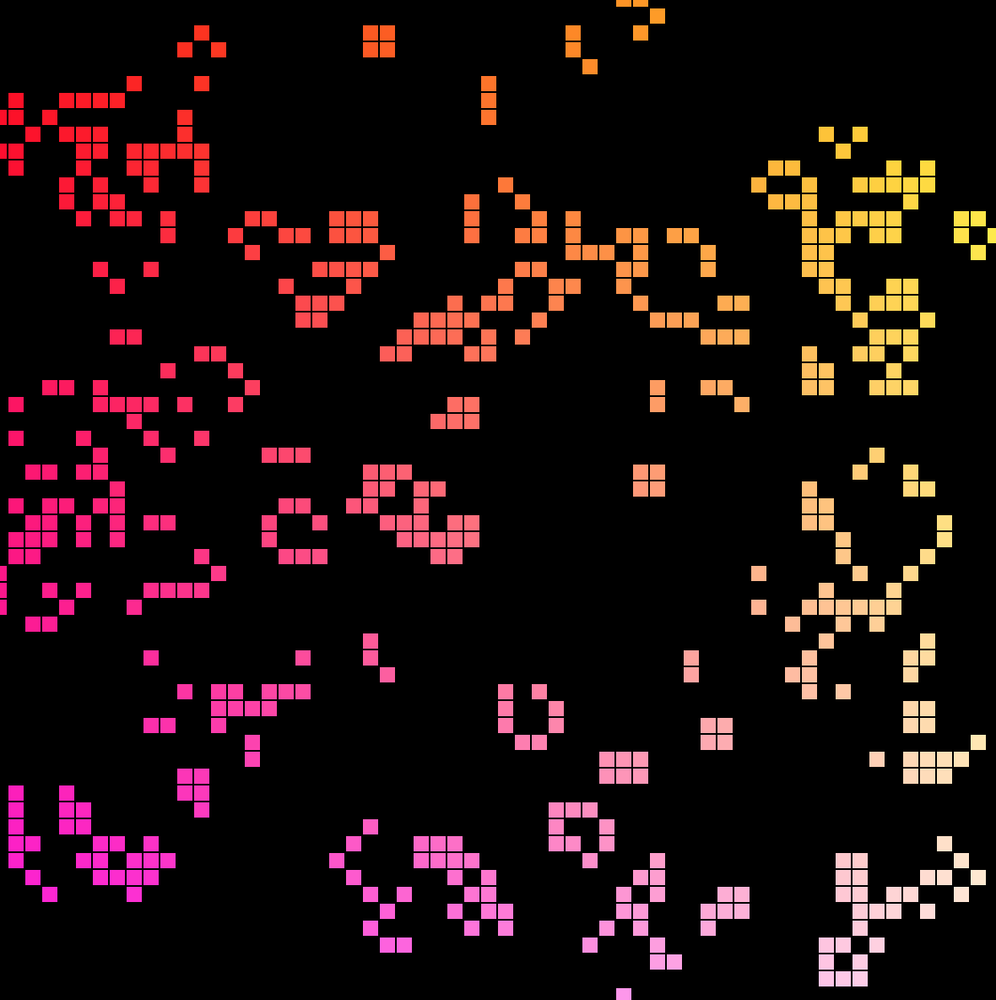

# Game Of Life in ReasonML

Hello! This project was made at a ReasonML Hackathon hosted at BlueBerry offices in Prague. Feel free to open pull requests with improvements or cleaner / more idiomatic Reason code.



# How to build
I used Reprocessing for the visual side of things but immediately encoutered a problem where the project is slightly behind the current bsb platform scripts. So I commited the changes I had to make within those projects (inside node_modules) and that's why you'll need to put them back after running yarn install. Here are the steps that should do the trick

```
yarn
git reset --hard
yarn build
```

# Build + Watch (dev)

Run this
```
yarn
git reset --hard
yarn start
```

And this in a separate terminal in order to get the bundled javascript
```
yarn webpack
```

And just open `public/index.html` in your browser

# Tests
```
yarn test
```